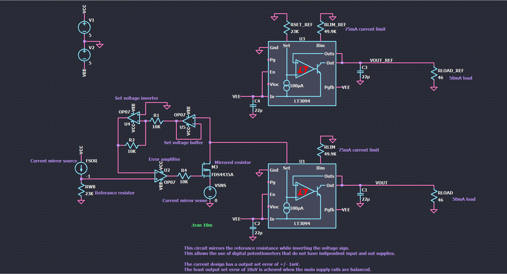

# Resistor Mirror
This repository contains an example circuit to demonstrate a resistor mirror.

This circuit allows the use of a DAC to control the set value of a Low-Dropout Linear regulator (LDO) regardless of the voltage restrictions on the DAC pins!

## Circuit schematic

